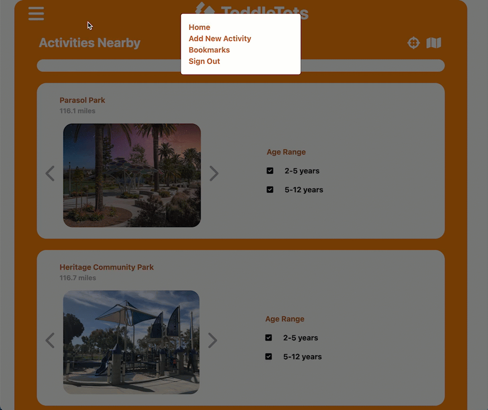

# ToddleTots

A full stack JavaScript application for parents and caregivers who want to find activities for kids.

## Technologies Used

- React.js
- Webpack
- Bootstrap 5
- Node.js
- Express.js
- PostgreSQL
- HTML5
- CSS3
- Babel
- Heroku
- JSON web token
- Argon2
- Sass
- Axios
- Lodash
- Reach Comobobox & use-places-autocomplete for the Search component
- API - react-google-maps for the geometry library to calculate spherical distance
- API - @react-google-maps/api for map rendering


## Live Demo

Try the application live at [https://toddletots.herokuapp.com/](https://toddletots.herokuapp.com/)

## Features

- Users can see list view & map view of activities
- Users can search for activities near a specified location
- Users can view full details of an activity
- Users can add a new activity by dropping a pin or manually inputting an address
- Users can edit an existing activity
- Users can delete an activity
- Users can bookmark an activity
- Users can see list view & map view of bookmarks
- Users can get navigation directions to an activity
- Users can sign up, sign in, and sign out

## Preview




## Development

### System Requirements

- Node.js 10 or higher
- NPM 6 or higher
- PostgreSQL

### Getting Started

1. Clone the repository.

    ```shell
    git clone https://github.com/rosemary-liu/toddletots.git
    cd toddletots
    ```

1. Install all dependencies with NPM.

    ```shell
    npm install
    ```

1. Import the example database to PostgreSQL.

    ```shell
    npm run db:import
    ```

1. Start the project. Once started you can view the application by opening http://localhost:3000 in your browser.

    ```shell
    npm run dev
    ```
